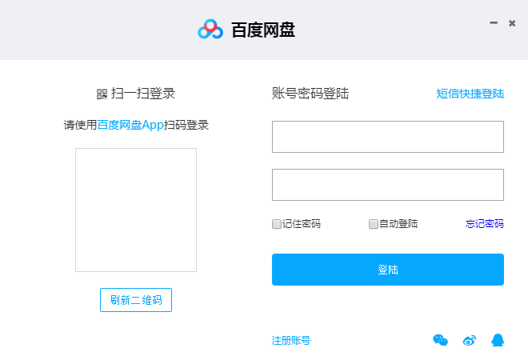
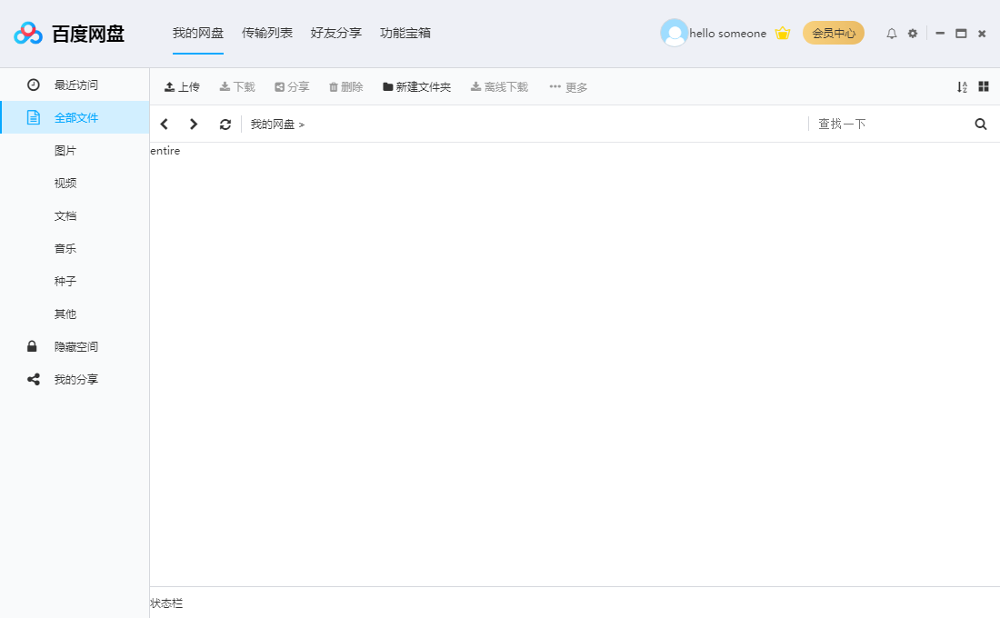
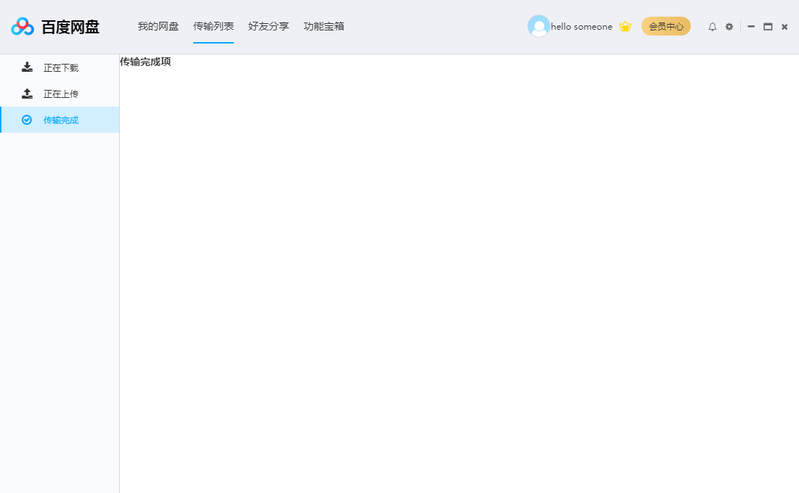
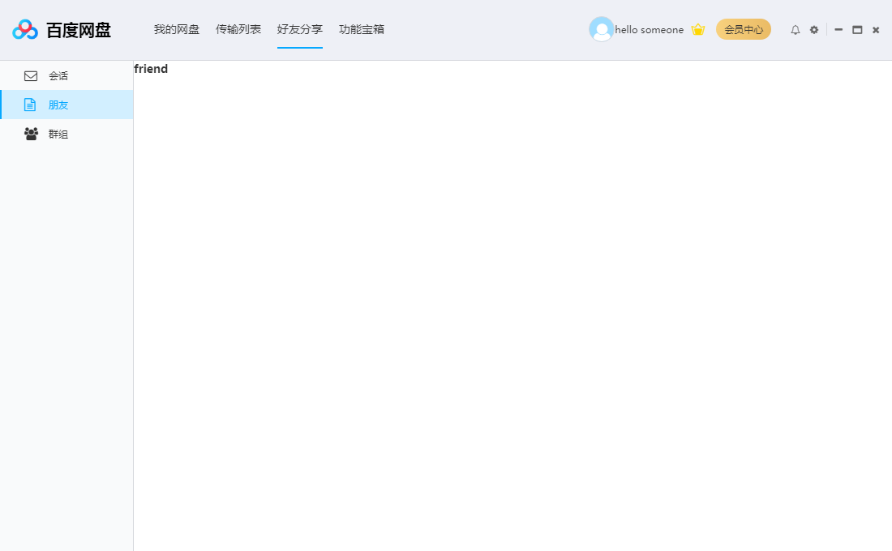
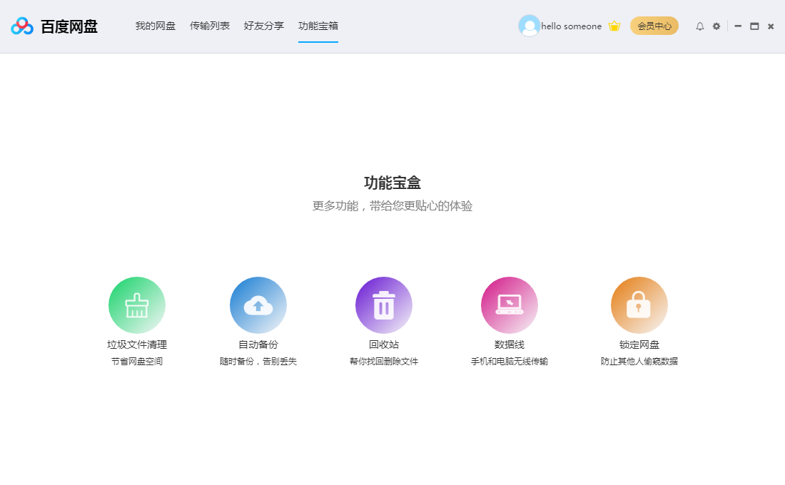

# baidupan

> 模仿百度云盘，使用electron-vue等框架编写的项目

#### 声明

> 该项目只是学习使用 
>
> 项目中使用的百度的UI以及百度的LOGO只为学习目的,如果侵犯了百度的权益,请百度联系我删除
>
> Email: kf_hz@sina.com

#### 启动

~~~javascript	
//node 8.15
# install dependencies
npm install

# serve with hot reload at localhost:9080
npm run dev

# build electron application for production
npm run build
~~~

#### 技术栈

~~~javascript	
vue
vue-router
electron
node
sqlite3
vuex
~~~

#### 项目结构

~~~javascript	
baidupan
│  .babelrc
│  .gitignore
│  .travis.yml
│  appveyor.yml
│  package-lock.json
│  package.json
│  README.md	
│  test.db							//sqlite3数据库文件
├─.electron-vue						
│      build.js
│      dev-client.js
│      dev-runner.js
│      webpack.main.config.js
│      webpack.renderer.config.js
│      webpack.web.config.js
│      
├─assets
│      image-20200115114356965.png
│      
├─build								
│  │  
│  │  
│  ├─icons
│  │      256x256.png
│  │      icon.icns
│  │      icon.ico
│  │      logo.ico
│  │      uninstall.ico
│        
│  
├─dist
│  ├─electron
│  │  │  .gitkeep
│  │  │  index.html
│  │  │  main.js								
│  │  │  renderer.js
│  │  │  
│  │  ├─fonts
│  │  │      fontawesome-webfont--fonts.eot
│  │  │      fontawesome-webfont--fonts.ttf
│  │  │      fontawesome-webfont--fonts.woff
│  │  │      fontawesome-webfont--fonts.woff2
│  │  │      
│  │  └─imgs
│  │          fontawesome-webfont--fonts.svg
│  │          logo--images.png
│  │          
│  └─web
│          .gitkeep
│          
├
│          
├─screenshot							//原型截图
│      friends.png
│      index.png
│      login.png
│      transfer.png
│      transfer2.png
│      treasure.png
│      
├─src									
│  │  index.ejs
│  │  
│  ├─main								
│  │      index.dev.js					//专门用于开发以及安装开发工具
│  │      index.js						//入口文件
│  │      
│  └─renderer
│      │  App.vue
│      │  main.js
│      │  router.js
│      │  
│      ├─api							
│      │      user.js					//用户的增删改sql
│      │      
│      ├─assets							//资源目录
│      │  │  .gitkeep
│      │  │  logo.png
│      │  │  
│      │  ├─css
│      │  │      base.less
│      │  │      font-awesome.css
│      │  │      font-awesome.min.css
│      │  │      iconfont.css
│      │  │      reset.css
│      │  │      
│      │  ├─fonts
│      │  │      fontawesome-webfont.eot
│      │  │      fontawesome-webfont.svg
│      │  │      fontawesome-webfont.ttf
│      │  │      fontawesome-webfont.woff
│      │  │      fontawesome-webfont.woff2
│      │  │      FontAwesome.otf
│      │  │      
│      │  └─images
│      │          hide.png
│      │          logo.ico
│      │          logo.png
│      │          share.png
│      │          
│      ├─components							//组件
│      │  ├─aside							
│      │  │      Aside.vue					//左边导航菜单
│      │  │      
│      │  ├─header
│      │  │      Header.vue					//顶部
│      │  │      
│      │  ├─status							//状态栏
│      │  │      Status.vue
│      │  │      
│      │  └─sub_title						//子菜单
│      │          SubTitleMenu.vue
│      │          
│      ├─config								//配置文件
│      │      config.js
│      │      
│      ├─db									
│      │      db.js							//封装的sqlite3操作					
│      │      
│      ├─pages								//页面
│      │  │  Home.vue						//首页
│      │  │  Login.vue						//登录页
│      │  │  
│      │  ├─friends							//好友分享
│      │  │      Friend.vue
│      │  │      Group.vue
│      │  │      Index.vue
│      │  │      Session.vue
│      │  │      
│      │  ├─home							//我的网盘
│      │  │      HideSpace.vue
│      │  │      Recent.vue
│      │  │      Share.vue
│      │  │      WholeFile.vue
│      │  │      
│      │  ├─magicBox						//功能宝箱
│      │  │      MagicBox.vue
│      │  │      
│      │  └─transferList					//传输列表
│      │          Download.vue
│      │          Finished.vue
│      │          Index.vue
│      │          Upload.vue
│      │          
│      └─utils
│              vueEvent.js
│              
└─static
        .gitkeep
~~~

#### 功能页面展示

+ 登录

  

+ 我的网盘

  

+ 传输列表

  

+ 好友分享

  

+ 功能宝箱

  

#### 问题

> 时间有限，只是匆忙的搭建了骨架，内里的数据业务处理地方后续慢慢填补
>
> 软件在启动的时候提示没有任何更新 暂时没有找到好点的办法